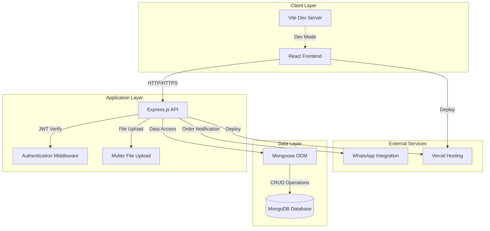
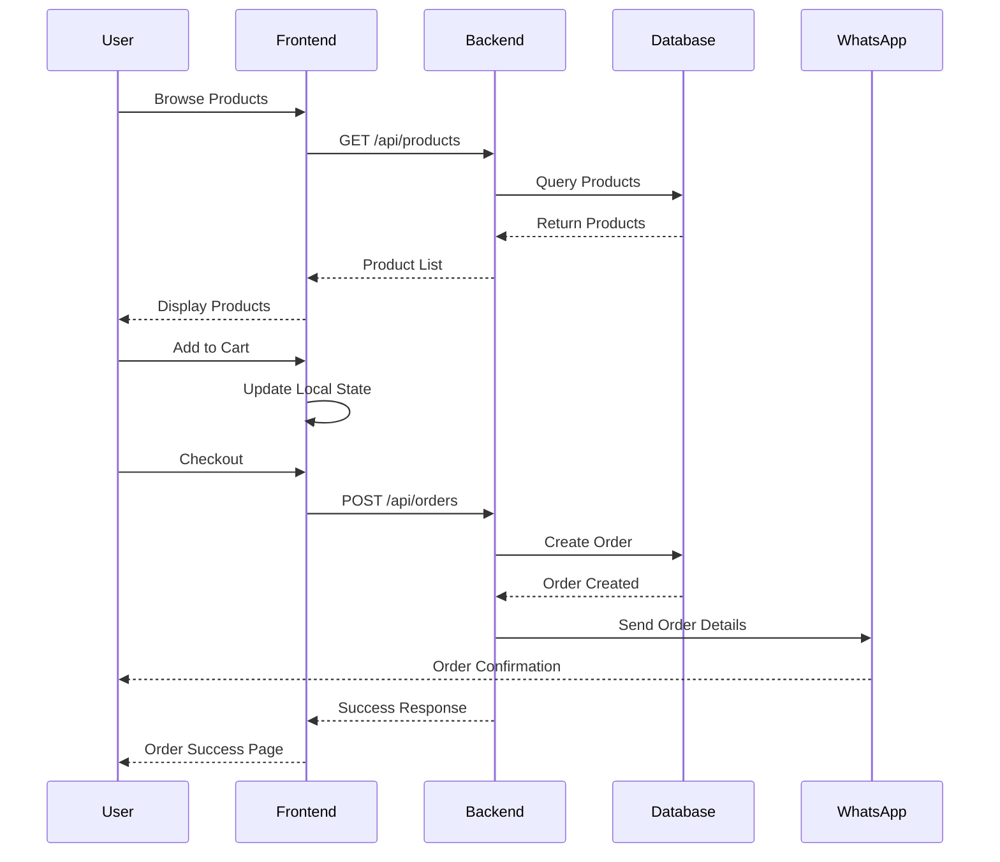

# 🎨 Aya Design - Custom Design E-Commerce Platform

<div align="center">


[](LICENSE)
[](https://nodejs.org/)
[](https://www.mongodb.com/)
[](https://reactjs.org/)
[](https://www.docker.com/)

**Platform e-commerce modern untuk memesan desain kustom seperti photocard, banner, dan frame akrilik dengan mudah dan cepat.**

[Demo Live](https://ayadesign-api-seven.vercel.app) • [Laporkan Bug](https://github.com/irfnriza/ayadesign-POPL-16/issues) • [Request Fitur](https://github.com/irfnriza/ayadesign-POPL-16/issues)

</div>

---

## 📋 Daftar Isi

- [Tentang Proyek](#-tentang-proyek)
- [Fitur Utama](#-fitur-utama)
- [Teknologi Stack](#-teknologi-stack)
- [Arsitektur Sistem](#-arsitektur-sistem)
- [Prerequisites](#-prerequisites)
- [Instalasi](#-instalasi)
  - [Development Mode](#development-mode)
  - [Docker Deployment](#docker-deployment)
- [Konfigurasi Environment](#-konfigurasi-environment)
- [API Documentation](#-api-documentation)
- [Struktur Proyek](#-struktur-proyek)
- [Testing](#-testing)
- [Deployment](#-deployment)
- [Contributing](#-contributing)
- [Tim Developer](#-tim-developer)
- [License](#-license)

---

## 🎯 Tentang Proyek

**Aya Design** adalah platform e-commerce berbasis web yang memungkinkan pengguna untuk memesan berbagai desain kustom dengan mudah. Platform ini dibangun dengan arsitektur modern menggunakan MERN Stack (MongoDB, Express.js, React, Node.js) dan dilengkapi dengan fitur-fitur canggih untuk memberikan pengalaman berbelanja yang optimal.

### 🌟 Keunggulan

- 🚀 **Performa Tinggi** - Menggunakan Vite untuk build tool yang super cepat
- 🎨 **UI/UX Modern** - Interface yang intuitif dengan Tailwind CSS dan Ant Design
- 🔒 **Keamanan Terjamin** - Implementasi JWT authentication dan password hashing
- 📱 **Responsive Design** - Optimal di semua perangkat (mobile, tablet, desktop)
- 🐳 **Docker Ready** - Mudah di-deploy dengan Docker containerization
- ⚡ **Real-time Updates** - Notifikasi dan update status pesanan secara real-time

---

## ✨ Fitur Utama

### Untuk Pelanggan

- **🔐 Autentikasi & Autorisasi**
  - Registrasi dan login dengan validasi email
  - Password recovery dan reset
  - JWT-based session management
  - Role-based access control

- **🛍️ Katalog Produk**
  - Browse produk dengan kategori (Photocard, Banner, Frame Akrilik)
  - Filter dan sorting produk
  - Search functionality dengan autocomplete
  - Product detail dengan gambar high-quality

- **🛒 Shopping Experience**
  - Shopping cart dengan update real-time
  - Wishlist untuk save produk favorit
  - Order summary dan price calculation
  - Multiple item management

- **💳 Checkout Process**
  - Integrasi WhatsApp untuk konfirmasi pesanan
  - Auto-generated order message
  - Order tracking dan history
  - Invoice generation (PDF)

- **👤 User Profile Management**
  - Update informasi profil
  - Upload dan crop foto profil
  - Order history dan status tracking
  - Address management

### Untuk Admin (Upcoming)

- Dashboard analytics
- Product management (CRUD)
- Order management
- User management
- Sales reporting

---

## 🛠 Teknologi Stack

### Frontend

| Teknologi | Versi | Deskripsi |
|-----------|-------|-----------|
|  | 18.3.1 | Library UI untuk membangun interface interaktif |
|  | 5.x | Build tool yang sangat cepat untuk development |
|  | 3.x | Utility-first CSS framework |
|  | 5.x | Component library untuk UI yang konsisten |
|  | 6.x | Client-side routing |
|  | 1.x | HTTP client untuk API calls |

### Backend

| Teknologi | Versi | Deskripsi |
|-----------|-------|-----------|
|  | 20.x | JavaScript runtime environment |
|  | 4.x | Web application framework |
|  | 7.x | NoSQL database |
|  | 8.x | MongoDB object modeling |
|  | 9.x | Token-based authentication |
|  | 1.x | File upload middleware |
|  | 5.x | Password hashing |

### DevOps & Tools

| Tool | Deskripsi |
|------|-----------|
|  | Containerization platform |
|  | CI/CD automation |
|  | Cloud deployment platform |
|  | Code linting |
|  | Code formatting |

---

## 🏗 Arsitektur Sistem



### Flow Diagram - User Journey



---

## 📦 Prerequisites

Sebelum memulai, pastikan sistem Anda memiliki:

- **Node.js** >= 16.0.0 ([Download](https://nodejs.org/))
- **npm** >= 8.0.0 atau **yarn** >= 1.22.0
- **MongoDB** >= 6.0 ([Download](https://www.mongodb.com/try/download/community))
- **Git** ([Download](https://git-scm.com/))
- **Docker** (Optional, untuk containerization) ([Download](https://www.docker.com/))

### Verifikasi Instalasi

```bash
node --version    # Should show v16.x.x or higher
npm --version     # Should show 8.x.x or higher
mongo --version   # Should show 6.x.x or higher
git --version     # Should show 2.x.x or higher
```

---

## 🚀 Instalasi

### Development Mode

#### 1. Clone Repository

```bash
git clone https://github.com/irfnriza/ayadesign-POPL-16.git
cd ayadesign-POPL-16
```

#### 2. Install Dependencies

**Backend:**
```bash
cd server
npm install
```

**Frontend:**
```bash
cd ../client
npm install
```

#### 3. Setup Environment Variables

**Server (.env):**
```bash
cd server
cp .env.example .env
```

Edit file `.env` dan isi dengan konfigurasi Anda:
```env
# Server Configuration
PORT=3000
NODE_ENV=development

# Database Configuration
MONGODB_URI=mongodb://localhost:27017/ayadesign
DB_NAME=ayadesign

# JWT Configuration
JWT_SECRET=your_super_secret_jwt_key_here
JWT_EXPIRE=7d
JWT_REFRESH_EXPIRE=30d

# File Upload Configuration
MAX_FILE_SIZE=5242880
UPLOAD_PATH=./uploads

# CORS Configuration
CLIENT_URL=http://localhost:5173

# WhatsApp Configuration
WHATSAPP_NUMBER=+6281234567890
WHATSAPP_API_URL=https://api.whatsapp.com/send
```

**Client (.env):**
```bash
cd ../client
cp .env.example .env
```

Edit file `.env`:
```env
VITE_API_URL=http://localhost:3000/api
VITE_APP_NAME=Aya Design
VITE_WHATSAPP_NUMBER=+6281234567890
```

#### 4. Setup Database

**Jalankan MongoDB:**
```bash
# Windows
mongod

# Linux/Mac
sudo systemctl start mongod
# atau
brew services start mongodb-community
```

**Seed Database (Optional):**
```bash
cd server
npm run seed
```

#### 5. Run Development Server

**Terminal 1 - Backend:**
```bash
cd server
npm run dev
```

**Terminal 2 - Frontend:**
```bash
cd client
npm run dev
```

Aplikasi akan berjalan di:
- **Frontend:** http://localhost:5173
- **Backend:** http://localhost:3000
- **API Docs:** http://localhost:3000/api-docs

---

### Docker Deployment

#### Quick Start dengan Docker Compose

```bash
# Build dan jalankan semua services
docker-compose up -d

# Lihat logs
docker-compose logs -f

# Stop services
docker-compose down
```

#### Manual Docker Build

```bash
# Build image
docker build -t ayadesign-app:latest .

# Run container
docker run -d \
  -p 3000:3000 \
  -p 5173:5173 \
  --name ayadesign-app \
  -e MONGODB_URI=mongodb://mongo:27017/ayadesign \
  ayadesign-app:latest

# Check running containers
docker ps

# View logs
docker logs -f ayadesign-app
```

#### Menggunakan Pre-built Image dari Docker Hub

```bash
# Pull image dari Docker Hub
docker pull irfnriza/ayadesign-app:latest

# Run container
docker run -d \
  -p 3000:3000 \
  -p 5173:5173 \
  --name ayadesign-container \
  irfnriza/ayadesign-app:latest

# Akses aplikasi
# Frontend: http://localhost:5173
# Backend: http://localhost:3000
```

#### Docker Commands Berguna

```bash
# Stop container
docker stop ayadesign-app

# Start container
docker start ayadesign-app

# Restart container
docker restart ayadesign-app

# Remove container
docker rm ayadesign-app

# Remove image
docker rmi irfnriza/ayadesign-app:latest

# View container logs
docker logs ayadesign-app

# Execute command inside container
docker exec -it ayadesign-app bash
```

---

## ⚙️ Konfigurasi Environment

### Environment Variables Detail

#### Server Environment Variables

| Variable | Type | Default | Description |
|----------|------|---------|-------------|
| `PORT` | number | 3000 | Port untuk backend server |
| `NODE_ENV` | string | development | Environment mode (development/production) |
| `MONGODB_URI` | string | - | MongoDB connection string |
| `JWT_SECRET` | string | - | Secret key untuk JWT token |
| `JWT_EXPIRE` | string | 7d | Durasi expire JWT access token |
| `JWT_REFRESH_EXPIRE` | string | 30d | Durasi expire JWT refresh token |
| `MAX_FILE_SIZE` | number | 5242880 | Maksimal ukuran file upload (bytes) |
| `UPLOAD_PATH` | string | ./uploads | Path untuk menyimpan uploaded files |
| `CLIENT_URL` | string | - | URL frontend untuk CORS |
| `WHATSAPP_NUMBER` | string | - | Nomor WhatsApp untuk order notification |

#### Client Environment Variables

| Variable | Type | Default | Description |
|----------|------|---------|-------------|
| `VITE_API_URL` | string | - | Base URL untuk API backend |
| `VITE_APP_NAME` | string | Aya Design | Nama aplikasi |
| `VITE_WHATSAPP_NUMBER` | string | - | Nomor WhatsApp untuk customer service |

---

## 📚 API Documentation

### Base URL

```
Development: http://localhost:3000/api
Production: https://ayadesign-api-seven.vercel.app/api
```

### Authentication Endpoints

#### Register User
```http
POST /api/auth/register
Content-Type: application/json

{
  "name": "John Doe",
  "email": "john@example.com",
  "password": "securePassword123",
  "phone": "+628123456789"
}

Response: 201 Created
{
  "success": true,
  "data": {
    "user": { ... },
    "token": "eyJhbGciOiJIUzI1NiIsInR5cCI6IkpXVCJ9..."
  }
}
```

#### Login User
```http
POST /api/auth/login
Content-Type: application/json

{
  "email": "john@example.com",
  "password": "securePassword123"
}

Response: 200 OK
{
  "success": true,
  "data": {
    "user": { ... },
    "token": "eyJhbGciOiJIUzI1NiIsInR5cCI6IkpXVCJ9..."
  }
}
```

### Product Endpoints

#### Get All Products
```http
GET /api/products?category=photocard&sort=price&order=asc&page=1&limit=10

Response: 200 OK
{
  "success": true,
  "data": {
    "products": [...],
    "pagination": {
      "page": 1,
      "limit": 10,
      "total": 50,
      "pages": 5
    }
  }
}
```

#### Get Product by ID
```http
GET /api/products/:id

Response: 200 OK
{
  "success": true,
  "data": {
    "product": { ... }
  }
}
```

### Order Endpoints

#### Create Order
```http
POST /api/orders
Authorization: Bearer {token}
Content-Type: application/json

{
  "items": [
    {
      "productId": "648a1b2c3d4e5f6789012345",
      "quantity": 2,
      "customization": "Custom text here"
    }
  ],
  "shippingAddress": {
    "name": "John Doe",
    "phone": "+628123456789",
    "address": "Jl. Example No. 123",
    "city": "Jakarta",
    "province": "DKI Jakarta",
    "postalCode": "12345"
  }
}

Response: 201 Created
{
  "success": true,
  "data": {
    "order": { ... },
    "whatsappUrl": "https://wa.me/..."
  }
}
```

### User Profile Endpoints

#### Get User Profile
```http
GET /api/users/profile
Authorization: Bearer {token}

Response: 200 OK
{
  "success": true,
  "data": {
    "user": { ... }
  }
}
```

#### Update Profile
```http
PUT /api/users/profile
Authorization: Bearer {token}
Content-Type: multipart/form-data

FormData:
- name: "John Doe Updated"
- phone: "+628123456789"
- profileImage: (file)

Response: 200 OK
{
  "success": true,
  "data": {
    "user": { ... }
  }
}
```

### Error Responses

```json
{
  "success": false,
  "error": {
    "message": "Error message here",
    "code": "ERROR_CODE",
    "status": 400
  }
}
```

**Common Error Codes:**
- `400` - Bad Request
- `401` - Unauthorized
- `403` - Forbidden
- `404` - Not Found
- `422` - Validation Error
- `500` - Internal Server Error

---

## 📁 Struktur Proyek

```
ayadesign-POPL-16/
├── 📁 .github/
│   └── 📁 workflows/           # GitHub Actions CI/CD
│       └── deploy.yml
├── 📁 api/                     # API utilities (Vercel serverless)
│   └── index.js
├── 📁 client/                  # Frontend React Application
│   ├── 📁 public/
│   │   ├── favicon.ico
│   │   └── assets/
│   ├── 📁 src/
│   │   ├── 📁 assets/          # Images, fonts, etc.
│   │   ├── 📁 components/      # Reusable components
│   │   │   ├── common/         # Button, Input, Card, etc.
│   │   │   ├── layout/         # Header, Footer, Sidebar
│   │   │   └── features/       # ProductCard, CartItem, etc.
│   │   ├── 📁 pages/           # Page components
│   │   │   ├── Home.jsx
│   │   │   ├── Products.jsx
│   │   │   ├── ProductDetail.jsx
│   │   │   ├── Cart.jsx
│   │   │   ├── Checkout.jsx
│   │   │   ├── Profile.jsx
│   │   │   ├── Login.jsx
│   │   │   └── Register.jsx
│   │   ├── 📁 hooks/           # Custom React hooks
│   │   │   ├── useAuth.js
│   │   │   ├── useCart.js
│   │   │   └── useProducts.js
│   │   ├── 📁 context/         # React Context providers
│   │   │   ├── AuthContext.jsx
│   │   │   └── CartContext.jsx
│   │   ├── 📁 services/        # API service functions
│   │   │   ├── api.js
│   │   │   ├── authService.js
│   │   │   ├── productService.js
│   │   │   └── orderService.js
│   │   ├── 📁 utils/           # Utility functions
│   │   │   ├── formatters.js
│   │   │   ├── validators.js
│   │   │   └── constants.js
│   │   ├── 📁 styles/          # Global styles
│   │   │   └── index.css
│   │   ├── App.jsx             # Root component
│   │   ├── main.jsx            # Entry point
│   │   └── router.jsx          # Route configuration
│   ├── .env.example
│   ├── .eslintrc.json
│   ├── index.html
│   ├── package.json
│   ├── tailwind.config.js
│   └── vite.config.js
├── 📁 server/                  # Backend Node.js Application
│   ├── 📁 src/
│   │   ├── 📁 config/          # Configuration files
│   │   │   ├── database.js     # MongoDB connection
│   │   │   └── jwt.js          # JWT configuration
│   │   ├── 📁 controllers/     # Request handlers
│   │   │   ├── authController.js
│   │   │   ├── productController.js
│   │   │   ├── orderController.js
│   │   │   └── userController.js
│   │   ├── 📁 models/          # Mongoose schemas
│   │   │   ├── User.js
│   │   │   ├── Product.js
│   │   │   └── Order.js
│   │   ├── 📁 routes/          # Express routes
│   │   │   ├── authRoutes.js
│   │   │   ├── productRoutes.js
│   │   │   ├── orderRoutes.js
│   │   │   └── userRoutes.js
│   │   ├── 📁 middleware/      # Custom middleware
│   │   │   ├── auth.js         # Authentication middleware
│   │   │   ├── errorHandler.js # Error handling
│   │   │   ├── validator.js    # Request validation
│   │   │   └── upload.js       # File upload (Multer)
│   │   ├── 📁 utils/           # Utility functions
│   │   │   ├── sendEmail.js
│   │   │   ├── generateToken.js
│   │   │   └── whatsapp.js
│   │   ├── 📁 seeders/         # Database seeders
│   │   │   └── productSeeder.js
│   │   └── index.js            # Server entry point
│   ├── 📁 uploads/             # Uploaded files directory
│   ├── .env.example
│   ├── .eslintrc.json
│   └── package.json
├── 📁 docker/                  # Docker related files
│   ├── Dockerfile.client
│   └── Dockerfile.server
├── .dockerignore
├── .gitignore
├── docker-compose.yml
├── docker-compose.hub.yml      # Using Docker Hub images
├── Dockerfile
├── package.json                # Root package.json
├── vercel.json                 # Vercel deployment config
├── build-and-run.sh           # Build script for Unix
├── build-and-run.bat          # Build script for Windows
├── LICENSE
└── README.md
```

---

## 🧪 Testing

### Unit Testing

```bash
# Run all tests
npm test

# Run tests with coverage
npm run test:coverage

# Run tests in watch mode
npm run test:watch
```

### E2E Testing

```bash
# Run Cypress tests
npm run test:e2e

# Open Cypress UI
npm run test:e2e:open
```

### API Testing dengan Postman

Import collection dari `postman_collection.json` yang tersedia di root project.

---

## 🚢 Deployment

### Deploy ke Vercel

#### 1. Install Vercel CLI

```bash
npm install -g vercel
```

#### 2. Login ke Vercel

```bash
vercel login
```

#### 3. Deploy

```bash
# Deploy preview
vercel

# Deploy to production
vercel --prod
```

#### 4. Environment Variables

Tambahkan environment variables di Vercel Dashboard:
- Settings → Environment Variables
- Tambahkan semua variable dari `.env`

### Deploy ke Heroku

```bash
# Login to Heroku
heroku login

# Create new app
heroku create ayadesign-app

# Add MongoDB addon
heroku addons:create mongolab:sandbox

# Set environment variables
heroku config:set JWT_SECRET=your_secret_here

# Deploy
git push heroku main
```

### Deploy dengan Docker

```bash
# Build production image
docker build -t ayadesign-prod .

# Tag image
docker tag ayadesign-prod username/ayadesign:latest

# Push to Docker Hub
docker push username/ayadesign:latest

# Deploy to server
ssh user@your-server
docker pull username/ayadesign:latest
docker-compose up -d
```

---

## 🤝 Contributing

Kami sangat terbuka untuk kontribusi dari siapa saja! Berikut adalah cara untuk berkontribusi:

### 1. Fork Repository

Klik tombol "Fork" di kanan atas halaman repository.

### 2. Clone Fork Anda

```bash
git clone https://github.com/YOUR_USERNAME/ayadesign-POPL-16.git
cd ayadesign-POPL-16
```

### 3. Create Branch

```bash
git checkout -b feature/amazing-feature
```

### 4. Commit Changes

```bash
git add .
git commit -m "Add: amazing new feature"
```

**Commit Message Convention:**
- `Add:` untuk fitur baru
- `Fix:` untuk bug fixes
- `Update:` untuk update fitur yang sudah ada
- `Remove:` untuk menghapus fitur
- `Refactor:` untuk refactoring code
- `Docs:` untuk dokumentasi

### 5. Push ke Branch

```bash
git push origin feature/amazing-feature
```

### 6. Create Pull Request

Buka pull request di GitHub dengan deskripsi yang jelas tentang perubahan yang Anda buat.

### Code Style Guidelines

- Gunakan ESLint dan Prettier
- Follow Airbnb JavaScript Style Guide
- Tulis kode yang clean dan readable
- Tambahkan comments untuk logic yang complex
- Buat unit test untuk fitur baru

### Reporting Bugs

Jika menemukan bug, silakan buat issue dengan:
- Deskripsi jelas tentang bug
- Steps to reproduce
- Expected vs actual behavior
- Screenshots (jika perlu)
- Environment details (OS, browser, Node version)

---

## 👥 Tim Developer

<table>
  <tr>
    <td align="center">
      <a href="https://github.com/akhsaniaa02">
        
        <br />
        <sub><b>Akhsania</b></sub>
      </a>
      <br />
      <sub>Full Stack Developer</sub>
    </td>
    <td align="center">
      <a href="https://github.com/irfnriza">
        
        <br />
        <sub><b>Irfan Riza</b></sub>
      </a>
      <br />
      <sub>Backend Developer</sub>
    </td>
    <td align="center">
      <a href="https://github.com/aufazaikra">
        
        <br />
        <sub><b>Aufa Zaikra</b></sub>
      </a>
      <br />
      <sub>Frontend Developer</sub>
    </td>
  </tr>
</table>

---

## 📄 License

Proyek ini dilisensikan dengan [MIT License](LICENSE) - lihat file LICENSE untuk detail lebih lanjut.

```
MIT License

Copyright (c) 2024 Aya Design Team

Permission is hereby granted, free of charge, to any person obtaining a copy
of this software and associated documentation files (the "Software"), to deal
in the Software without restriction, including without limitation the rights
to use, copy, modify, merge, publish, distribute, sublicense, and/or sell
copies
